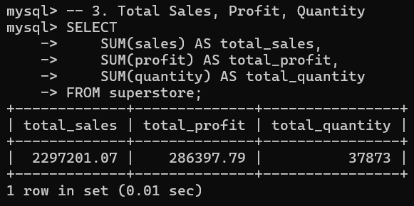
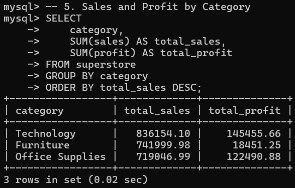
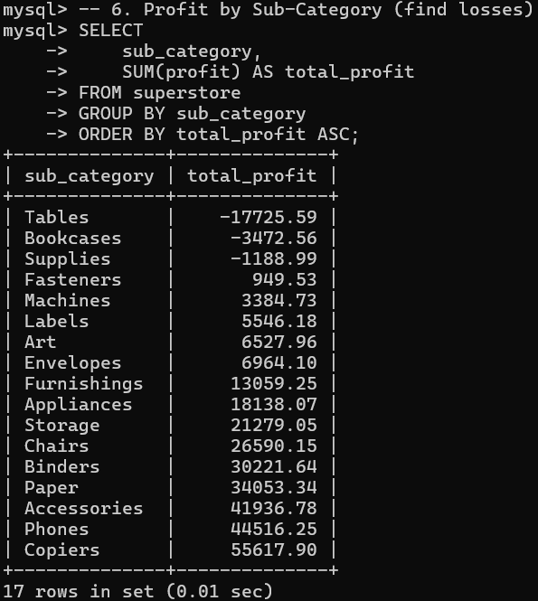
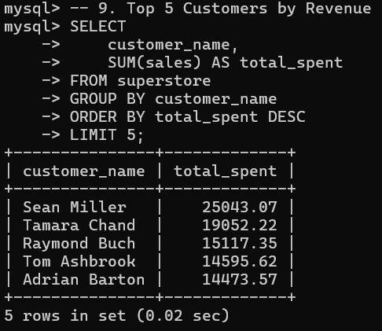
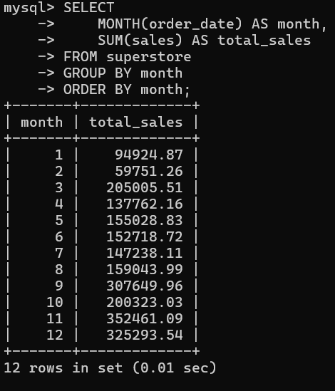
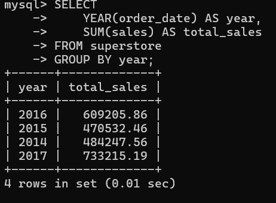
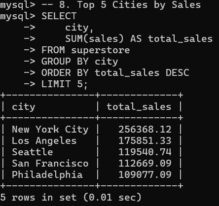

# Superstore SQL Data Analysis

## Overview
This project focuses on analyzing a retail Superstore dataset using SQL to extract meaningful business insights. The objective is to understand sales performance, profitability, customer behavior, and trends over time.

The dataset contains transactional-level data including orders, customers, products, sales, and profit. SQL queries were used to clean, explore, and analyze the dataset.

---

## Dataset Description
The dataset includes the following key fields:

- Order details: Order ID, Order Date, Ship Date  
- Customer details: Customer Name, Segment, Region  
- Product details: Category, Sub-Category, Product Name  
- Sales metrics: Sales, Quantity, Discount, Profit  

---

## Key Analysis Performed

### 1. Total Sales and Profit
Calculated overall business performance using aggregate functions.

**Insight:**  
The business generates strong total revenue, but profit margins vary, indicating that not all sales contribute equally to profitability.

---

### 2. Sales by Category
Analyzed how different product categories contribute to total sales.

**Insight:**  
Some categories dominate revenue generation, highlighting where the business is most dependent.

---

### 3. Sub-Category Loss Analysis
Identified sub-categories with negative profit.

**Insight:**  
Certain sub-categories consistently generate losses, suggesting issues like excessive discounts or pricing inefficiencies.

---

### 4. Top Customers
Identified top 5 customers based on total spending.

**Insight:**  
A small group of customers contributes significantly to revenue, indicating potential for targeted retention strategies.

---

### 5. Monthly Sales Trend
Analyzed how sales change across months.

**Insight:**  
Sales show seasonal patterns with certain months performing significantly better than others.

---

### 6. Yearly Sales Trend
Analyzed yearly growth in sales.

**Insight:**  
The business shows an overall growth trend, indicating increasing demand over time.

---

### 7. Top 5 Cities by Sales
Identified cities generating the highest revenue.

**Insight:**  
Sales are concentrated in a few major cities, highlighting key geographic markets for the business.

---

## Storytelling Summary

The analysis reveals that while the business generates strong overall revenue, profitability is uneven across products and regions. A few categories and customers drive a large portion of sales, indicating reliance on specific segments.

At the same time, certain sub-categories operate at a loss, suggesting inefficiencies in pricing or discount strategies. Sales trends indicate seasonal patterns and steady yearly growth, pointing to a stable but improvable business model.

Geographically, revenue is concentrated in select cities, offering opportunities for expansion or focused marketing.

Overall, the business is performing well but can improve profitability by addressing loss-making products and optimizing its product mix.

---

## Interview Questions and Answers

### 1. What is the difference between WHERE and HAVING?
WHERE filters rows before aggregation, while HAVING filters results after GROUP BY and aggregation.

---

### 2. What are the different types of joins?
- INNER JOIN: Returns matching records from both tables  
- LEFT JOIN: Returns all records from the left table and matching from the right  
- RIGHT JOIN: Returns all records from the right table and matching from the left  
- FULL JOIN: Returns all records from both tables  

---

### 3. How do you calculate average revenue per user in SQL?
By dividing total revenue by the number of distinct users.

Example logic:
Total Revenue / COUNT(DISTINCT customer_id)

---

### 4. What are subqueries?
Subqueries are queries nested inside another query. They are used to perform intermediate calculations and filter results.

---

### 5. How do you optimize a SQL query?
- Use indexes on frequently queried columns  
- Avoid unnecessary columns in SELECT  
- Use efficient joins  
- Filter data early using WHERE  

---

### 6. What is a view in SQL?
A view is a virtual table created from a query. It simplifies complex queries and improves readability.

---

### 7. How would you handle null values in SQL?
- Use IS NULL to identify them  
- Replace using functions like COALESCE  
- Or update values based on business logic  

---

## Conclusion
This project demonstrates how SQL can be used to analyze structured data and extract meaningful business insights. The analysis highlights key performance areas, identifies inefficiencies, and provides a foundation for data-driven decision-making.
